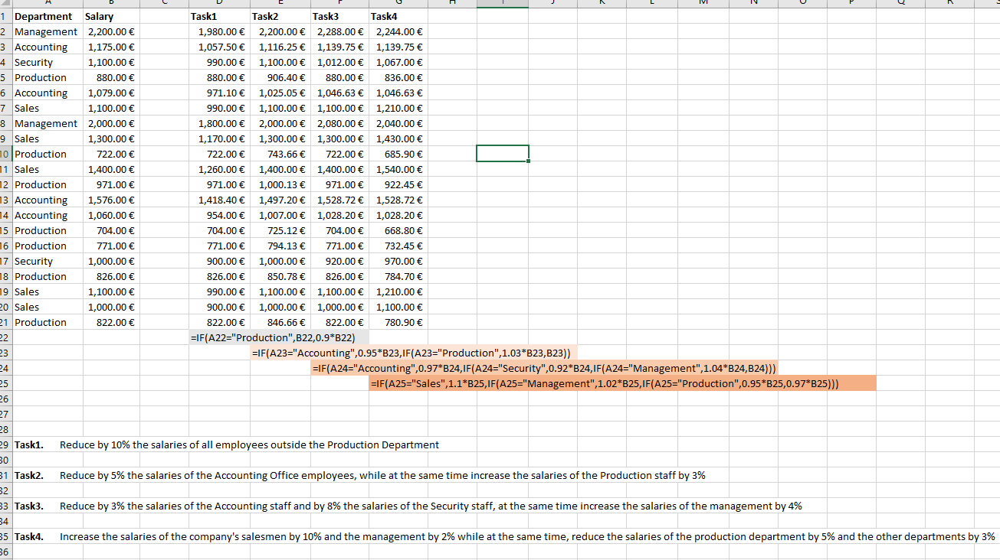
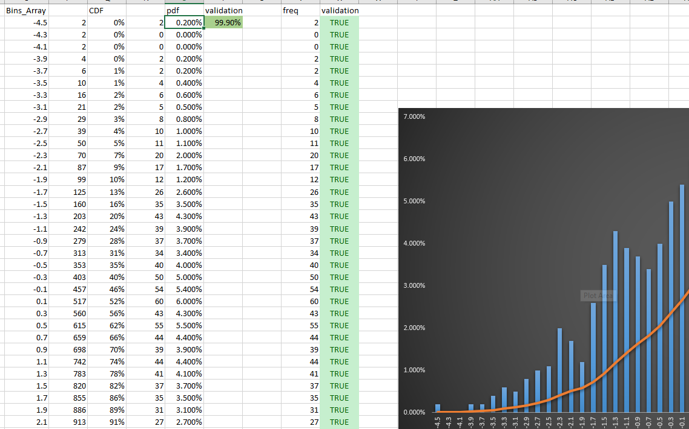
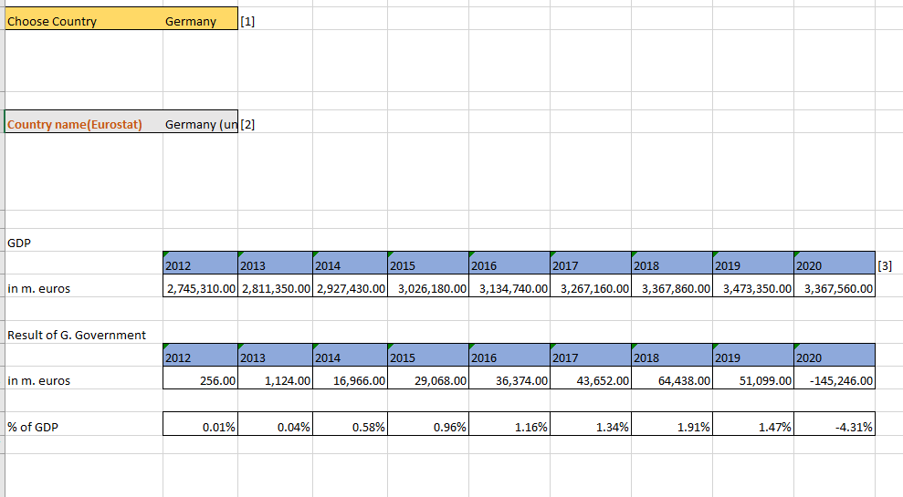

# Exercises-in-Excel

## Project Overview
In this project I am using Excel to solve many exercises using the techniques  
I learned during the course "Data Analyst" from National and Kapodistrian University of Athens.  
- Control structures in ms excel
- Descriptive statistics
- Using Ms Excel as a Database tool

##  1) Control structures in ms excel
To see the raw data from all the exercises and the tasks in question use this **[Link](https://github.com/DimKaisaris/Exercises-in-Excel/tree/main/raw%20files)**
Check the solution is this **[File](https://github.com/DimKaisaris/Exercises-in-Excel/blob/main/processed%20files/set1.xlsx)**

## 2) Descriptive statistics
In this exercise I calculate many statistics using functions as : min, max,  
average, var.p and validate them using the data analysis tool!  
Also I calculated and plotted CDF,PDF
Check the solution **[Here](https://github.com/DimKaisaris/Exercises-in-Excel/blob/main/processed%20files/set2.xlsx)**

## 3) Using Ms Excel as a Database tool
In this one I used the functions vlookup,index,match,offset as well as  
data validation methods. Check the solution **[Here](https://github.com/DimKaisaris/Exercises-in-Excel/blob/main/processed%20files/set3.xlsx)**

